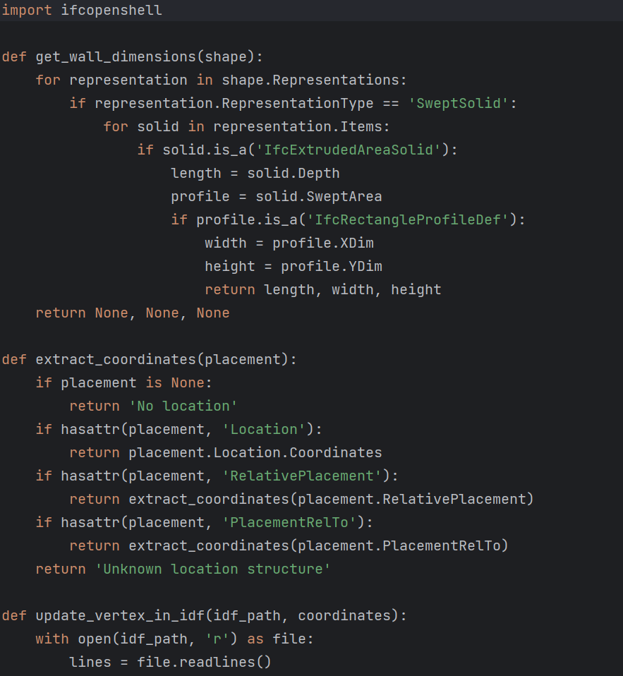
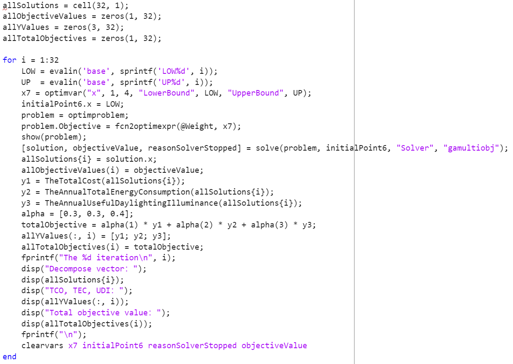

# A multi-objective window placement approach using BIM and surrogate model
 
## !!! As the paper is under review, all contents in this repository currently are not allowed to be re-used by anyone until this announcement is deleted.

# 1 Summary of supplemental materials
This table below shows all supplemental materials. All sheets in Tables S1, S2, and S3 are arranged in the order shown in this table.

# 2 General Introduction

2.1 This repository aims at providing the codes and data regarding the paper entitled “……” for the public, and it is developed by University of XXX in UK,  The University of XXX in Hong Kong SAR, and XXX University in China.

2.2 We greatly appreciate the selfless spirits of these voluntary contributors of a series of open python libraries, including ifcopenshell (https://github.com/stefkeB/ifcopenshell_examples), pyautocad (https://github.com/reclosedev/pyautocad), and so on. Our work stands on the shoulders of these giants.

2.3 As for anything regarding the copyright, please refer to the MIT License or contact the authors.
# 3 The time consumption comparison
 
3.1 The EnergyPlus simulation software necessitates 0.46 seconds for a singular WPS simulation, whereas the surrogate model requires only 0.0005 seconds with the same computer configurations when assessing the TEC and UDI of WPSs.

↑↑↑Time for software simulation to process one WPS of one room

↑↑↑Time for surrogate model to process one WPS of one room

3.2 The surrogate model averages 14.79 seconds for the entire WPS optimization process for the case building, while API-based automatic simulation is expected to take up to 12420 seconds (about 3.45 hours) for an equivalent number of WPSs.

↑↑↑Time for deriving one building-level WPS using surrogate model-based approach

# 4 Repository reuse 
## 4.1 Set environment 
All environmental configurations are specified in the requirement.

Before submitting these codes to Github, all of them have been tested to be well-performed. Even so, we are not able to guarantee their operation in other computing environments due to the differences in the python version, computer operating system, and adopted hardware.

## 4.2 Reuse or Retrain the models 

The window placement methodology in the paper can be transferred to new buildings beyond the case study, with the IFC2IDF function library for data transformation and the NSGA-II-based WPS optimization algorithm remaining unchanged for direct reuse. 

↑↑↑IFC2IDF function library

↑↑↑Codes for taking the G1 function as an example

↑↑↑Codes for NSGA-II-based WPS optimization algorithm
